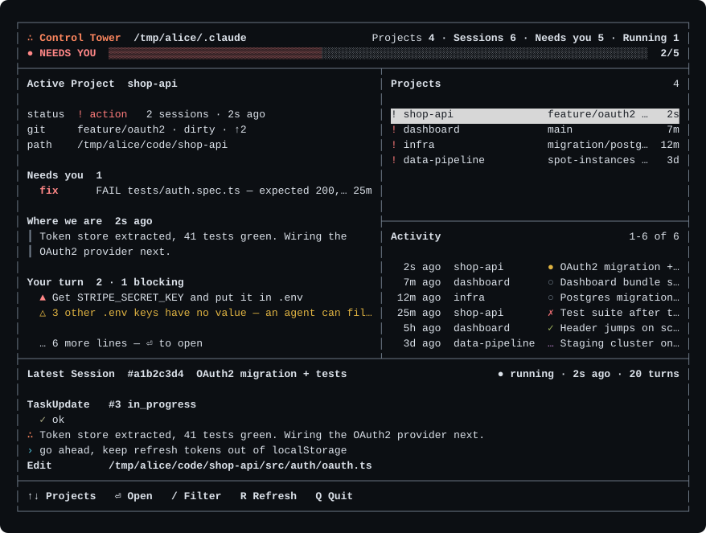
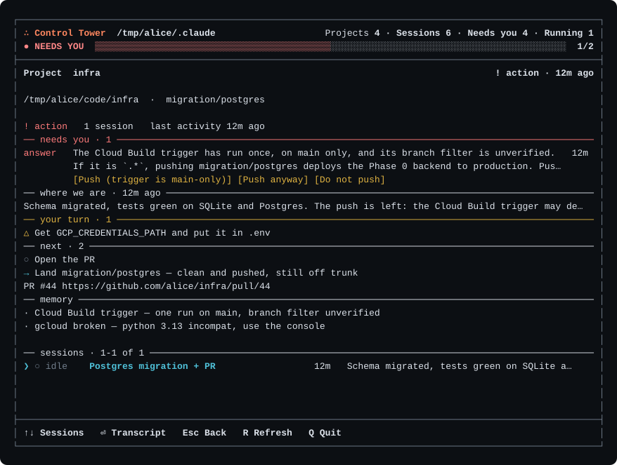

<p align="center">
  
</p>

<h1 align="center">Control Tower</h1>

<p align="center">
  One screen for every project you run <a href="https://claude.com/claude-code">Claude Code</a> in.<br>
  What state it is in · what it is waiting on you for · what only you can do · where the work got to · what comes next.
</p>

<p align="center">
  <a href="https://github.com/bybysker/control-tower/actions"></a>
  <a href="https://github.com/bybysker/control-tower/releases/latest"></a>
  <a href="LICENSE"></a>
</p>

Local. Read-only. It reads the transcripts Claude Code already writes, runs
`git status`, and reads **key names** from `.env` — nothing leaves your machine
unless you ask it to.

## Prerequisites

| | |
|---|---|
| **Node** | 20 or newer — `node -v` |
| **Claude Code** | installed and used at least once, so `~/.claude/projects` exists |
| **git** | for the branch / dirty / unpushed column |
| **OS** | macOS or Linux, in a terminal at least 80 columns wide |
| *optional* `gh` | for `--secrets` (are the repository secrets your CI needs actually set?) |
| *optional* `claude` on `PATH` | for `--ai` (next steps written by Claude, opt-in) |

## Install

```sh
npm install -g https://github.com/bybysker/control-tower/releases/download/v0.1.1/control-tower-0.1.1.tgz
control-tower
```

Try it without installing:

```sh
npx github:bybysker/control-tower --once
```

`control-tower --once` paints one frame and exits; in a pipe it prints plain
text instead, so `--once | grep '^  !'` lists everything waiting on you.
Uninstall with `npm uninstall -g control-tower`.

> Not `npm install -g github:…`? That form is broken on npm 10.8 (bundled with
> Node 20) — it links a temporary clone that npm then deletes. Measured.

## What you see

<p align="center">
  
</p>

- **Needs you** — Claude asked a question and is waiting; a tool call errored; a permission prompt is pending.
- **Your turn** — what nobody can delegate: `▲ Get STRIPE_SECRET_KEY` needs a console and a card. The twenty variables an agent *can* fill collapse into one line.
- **Where we are** — the last thing Claude said.
- **Next** — `✓●○` from Claude's own plan, `→` from the repository (unpushed, uncommitted, unpublished), `∴` from Claude, if you opt in.

Every status is a deduction from files, and the docs say where each one can be
wrong: [docs/status-heuristics.md](docs/status-heuristics.md).

## Keys

`↑↓` projects · `⏎` open · `/` filter · `r` rescan · `q` quit — and inside a
project, `⏎` again for the transcript, `esc` back.

## Options

```
--once                 one frame and exit (plain text in a pipe; --plain to force it)
-f, --filter <text>    status, action, project or title
--no-git               do not run git status
--no-user-tasks        do not read .env key names
--secrets              ask GitHub which repository secrets exist   (network)
--ai                   next steps written by Claude, on key A       (network, cached)
-p, --path <dir>       a Claude home other than ~/.claude
```

## What it reads, and what it never touches

`~/.claude/projects/**/*.jsonl`, `git status` in each project, and the **names**
of keys in `.env.example` / `.env` — values are inspected for emptiness and
discarded, and a test plants a sentinel secret to prove none escapes. It never
writes inside `~/.claude`, never resumes or kills a session. `--ai` and
`--secrets` are the only things that touch the network, both opt-in.

## More

- [The full guide](docs/guide.md) — every panel, every source, the plugin, the `--ai` contract.
- [How the `~/.claude` format was reverse-engineered](docs/data-source.md).
- [CONTRIBUTING.md](CONTRIBUTING.md) · [CLAUDE.md](CLAUDE.md), the invariants that bite.

MIT.
